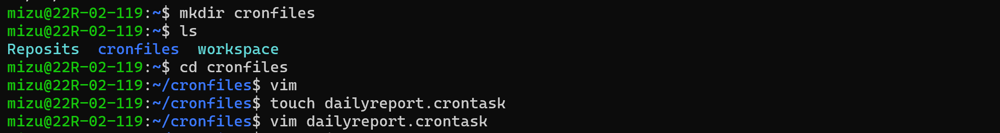
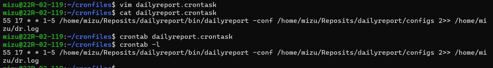

# dailyreport

A Go program to generate and share daily work reports. License: MGPL.v1.4. All rights reserved.

## Quick Start

1. Install Go 1.20 or later.

    ```bash
    $ go version
    go version go1.20.5 linux/amd64
    ```

2. Clone this repository.

    ```bash
    git clone https://github.com/mizumoto-cn/dailyreport.git
    ```

3. Run

    ```bash
    cd dailyreport/cmd
    go run .
    ```

4. Use Crontab for periodically running the program.

    ```bash
    crontab -e
    ```

    Add the following line to the crontab file.

    ```bash
    55 17 * * 1-5 cd /path/to/dailyreport/cmd && go run .
    ```

    This will run the program at 17:55 from Monday to Friday.

    
    

> See [template](./template) folder for the template files.
> > [template/dailyreport.txt](./template/dailyreport.txt) is the template for the daily report content.
> > [template/template.html](./template/template.html) is the template for the daily report email.
> > [template/config.yaml.template](./template/config.yaml.template) is the template for the configuration file.

## License

This project is licensed under the Mizumoto General Public License, Version 1.4. You can find the full license text in [LICENSE](./LICENSE/Mizumoto.General.Public.License.v1.4.md).

The _entities_\* on the [Disqualified Entities List](./LICENSE/Disqualified.Entities.List.md) are prohibited from using _files_\*\* from this project in any way.

---
> \*/\*\*: See chapter [#Restrictions for Users](./LICENSE/Mizumoto.General.Public.License.v1.4.md/#restrictions-for-users) for definitions of _entities_ and _files_.
